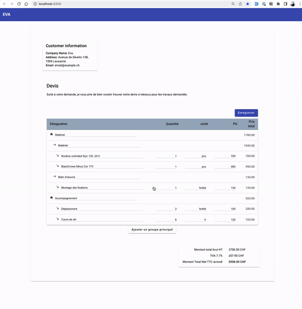

# Angular quote app

# What this Angular app is about:

- Create a structured quote (main Group, subGroup, and quotationLine),
- It is possible to add lines, modify them, or remove them.
- It is only possible to add quantity, units, and unit prices on "Quotation lines",
- Each position/item has a recap of the total price of its children on its line,
- By right clicking, it is possible to add a new Line. The new line will be added as the last child of its parent.
- The total price and price breakdown are dynamically computed.
- Once you are satisfied with your Quote, click on "Enregistrer" to persist it in a fake server-side database.

# Technical approach

## Data-structure

- The quotation is a tree, with a root node which is not displayed. This allows to recursively compute each totalPrice. It also allows to add new lines easily in the database.
- The table is a mat-table, mixed with a reactive mat-form, which complicates a lot the script of the component, especially regarding the insertion of new lines.

## Development server

After `npm install`
Run `ng serve` for a dev server. Navigate to `http://localhost:4200/`. The application will automatically reload if you change any of the source files.
Run `npm run json-server` for a fake server api. Navigate to `http://localhost:3000/`.

## Remarks

- Form Validation could be added,
- Responsiveness could be added,
- Generic UI and styling could be improved,
- Use scss or sass instead of css for readability, and maintenability
- There is still a console error related to the total Price update between the components,
- The context menu feature has been adapted from an third-party existing code snippet,
- Global typing could be improved,
- No tests here,
- No localization neither,
- This project was generated with [Angular CLI](https://github.com/angular/angular-cli) version 15.2.1.
